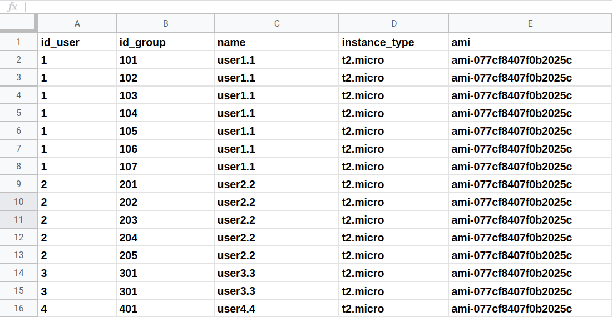
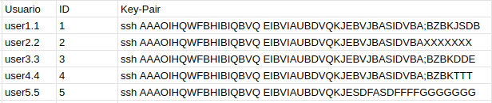
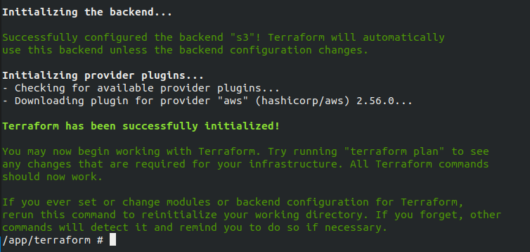

# Infraestrutura como código utilizando Terraform

<!--
*** Thanks for checking out this README Template. If you have a suggestion that would
*** make this better, please fork the repo and create a pull request or simply open
*** an issue with the tag "enhancement".
*** Thanks again! Now go create something AMAZING! :D
-->


<!-- PROJECT SHIELDS -->
<!--
*** I'm using markdown "reference style" links for readability.
*** Reference links are enclosed in brackets [ ] instead of parentheses ( ).
*** See the bottom of this document for the declaration of the reference variables
*** for contributors-url, forks-url, etc. This is an optional, concise syntax you may use.
*** https://www.markdownguide.org/basic-syntax/#reference-style-links
-->
[![Contributors][contributors-shield]][contributors-url]
[![Forks][forks-shield]][forks-url]
[![Stargazers][stars-shield]][stars-url]
[![Issues][issues-shield]][issues-url]
[![MIT License][license-shield]][license-url]
[![LinkedIn][linkedin-shield]][linkedin-url]


<!-- PROJECT LOGO -->
<br />
<p align="center">
  <a href="http://www.insper.edu.br">
    
  </a>

  <h3 align="center">INSPER</h3>

  <p align="center">
    Um Projeto para facilitar a infraestrutura das disciplinas, Engenharia de Computação!!!
    <br />
    <a href="http://www.insper.edu.br"><strong>Acesse o Site da Faculdade</strong></a>
    <br />
    <br />
    <a href="https://github.com/Insper">View Github Insper</a>
    ·
    <a href="https://github.com/TiagoDemay/Terraform_IaaC_AWS/issues">Report Bug</a>
    ·
  
  </p>
</p>


<!-- ABOUT THE PROJECT -->
## Sobre o Projeto...


Este projeto está sendo desenvolvido com a intenção de facilitar a criação da infraestrutura de Nuvem das disciplinas de Supercomputação e Computação em Nuvem da Faculdade Insper, para o curso de Engenharia de Computação.

Porque utilizar Terraform:
* O Terraform é uma ferramenta para criar, alterar e criar versões de infraestrutura. 
* Os arquivos de configuração descrevem para Terraform os componentes necessários para executar um único aplicativo ou todo o seu datacenter que no nosso foco inicial é a AWS, mas como estamos construindo uma Cloud interna utilizando as tecnologias da VMware com o ESXi, poderemos utilizar mais para frente este mesmo projeto, alterando o provedor e as suas espeficidades.
 * Como o Terraform gera um plano de execução descrevendo o que fará para atingir o estado desejado e, em seguida, executa-o para construir a infraestrutura descrita, podemos padronizar o ambiente de cada aluno e conforme a configuração muda, o Terraform pode determina o que mudou e com comandos básicos criamos planos de execução incrementais que podem ser aplicados.
* Também como projeto futuro temos a intenção de utilizar a feramenta Ansible para provisionamento, gerenciamento de configuração e implantação de aplicativos de software livre.


### Documentações das ferramentas de desenvolvimento utilizadas:

* [Terraform](https://www.terraform.io/docs/index.html)
* [AWS](https://docs.aws.amazon.com/index.html)
* [Docker](https://docs.docker.com/)
* [VScode](https://code.visualstudio.com/docs)


<!-- GETTING STARTED -->
## Pré requisitos

Como pré requisito instale o Docker em sua máquina seguindo as orientações na doc oficial, de acordo com seu Sistema Operacional.

No meu caso, instalei utilizando o comando curl:
* Docker no Linux Ubuntu 18.04
```sh
curl -SsfL https://get.docker.com | sh -
```

## Iniciando

Como vamos utilizar o Docker e o Terraform é apenas um binário que já está instalado na imagem que criei, só precisamos dos seguintes passos

1. Crie uma pasta para iniciar o projeto.
```sh
mkdir iaac_insper
cd iaac_insper/

```
2. Clone este repositório
```sh
git clone https://github.com/TiagoDemay/Terraform_IaaC_AWS.git
```
3. Rodar o script para baixar a imagem e executar o container
```sh
cd Terraform_IaaC_AWS/
sudo ./container_terraform.sh
```

* Com estes comando você já deve estar dentro do container na pasta "/app"
* Caso você saia do container e ele pare, terá que inicia-lo novamente para acessa-lo:

Este comando serve para pegar o ID do container
```sh
docker images
```
Estes dois te colocam no terminal do container novamente
```sh
docker container start >id_container>
docker container attach <id_container>
```

Lembre-se que a pasta que você iniciou o projeto está sendo compartilhada como o container,

Pelo bem ou pelo mal, apagar ou alterar qualquer arquivo na pasta no seu "host" irá alterar os arquivos dentro do container e vice e versa.

### Este projeto está estruturado para ser utilizado com 2 planilhas, que são referenciadas no arquivo de variáveis com os nomes de: planilhaINST.csv e planilhaIAM.csv, como elas contem dados de informação sensível, não estão compartilhadas aqui. As imagens abaixo demonstram as configurações que elas devem seguir:

- planilhaINST.csv
<p align="left">
  <a href="https://github.com/TiagoDemay/Terraform_IaaC_AWS/tree/master/images">
    
  </a>
</p>

- planilhaIAM.csv
<p align="left">
  <a href="https://github.com/TiagoDemay/Terraform_IaaC_AWS/tree/master/images">
    
  </a>
</p>


## Usage
  
Para fazer a utilização deste projeto você deve seguir as seguintes etapas:

1. Criar um bucket s3 na AWS, aqui eu estou criando um backend em um bucket S3 para salvar o estado da infraestrutura, no arquivo terraform/main.tf
    * Se prefirir ter tudo local, comente a linha 8 até a 14 
    * Se prefirir manter a mesma topologia coloque o nome do seu bucket na linha 11
    * Este projeto foi feito na região "us-east-2", caso queira alterar esta configuração deve ser feita neste mesmo arquivo. 
2.  Para os comandos abaixos você deve estar dentro do cointainer e passar as credenciais da sua conta na AWS
```sh
/app/terraform # export AWS_ACCESS_KEY_ID="AKXXXXXXXXXXXXXXXXXX"
/app/terraform # export AWS_SECRET_ACCESS_KEY="5DXXXXXXXXXXXXXXXXXXXXXXXXXXXXXXXXXXXXXX"
```
3.  Agora dentro da pasta terraform daremos o comando para iniciar o terraform e configurar nosso backend s3
```sh
/app/terraform # terraform init
```
sua resposta deve ser parecida com esta:

<p align="left">
  <a href="https://github.com/TiagoDemay/Terraform_IaaC_AWS/tree/master/images">
    
  </a>
</p> 
 
4.  Agora criaremos um plano no terraform, para analisar as mudanças que ele irá fazer a sua conta AWS.
* O nome do seu arquivo de saída pode ser qualquer um escolhido por você, para que fique didático eu escolhi o nome "plano" 

```sh
/app/terraform # terraform plan -out plano
```  
* Na saída do seu terminal estão todas as modificações que serão feitas na sua estrutura na região escolhida da AWS.
* Um detalhe muito legal do terraform é que aqui ele demonstra tudo que será adicionado, alterado ou destruido na sua insfraestrutura com um toque para facilitar a visualização:
    1. to add     --- trás um simbolo de adição (+) em verde para demostrar o que será criado.
    2. to change  --- trás um simbolo de til (~) em amarelo para demostrar mudança de estado do recurso criado.
    3. to destroy --- trás um simbolo de subtração (-) em vermelho para demonstrar o que será excluido da infraestrutura.
* Ainda neste passo é possivel "debugar" erros de programação e analisar respostas de recursos a serem criados, antes de subir a estrutura para a AWS, basta alterar os arquivos e recursos que desejar, salvar os documentos alterados e rodar o comando novamente, até ficar satisfeito com o PLANO de criação.
* Se for a primeira vez que roda o programa ele deve mostrar:
 Plan: 41 to add, 0 to change, 0 to destroy.    

5. Então depois de analisar se é isso mesmo que você deseja criar é só dar o comando: 
```sh
/app/terraform # terraform apply "plano"
``` 
E simples assim sua infraestrutura será criada.

Na saída do seu terminal deverá aparecer outups:

1. ARN_USER: onde tem o numero da conta onde o usuário user.user1 poderá acessar e o nome do usuário também aparece aqui.
2. A lista de IPv4 publico que suas instancias adquiriram no momento da criação.


## Observação sobre a senha de login ao Console AWS, que é criada para user.user1 neste projeto.

+ Para criar o acesso para o usuário, precisamos trabalhar com um tipo de criptografia assimétrica do tipo "gpg", à qual eu não conheço muito ainda.
Durante minhas pesquisas e a criação desta imagem, eu consegui gerar uma chave criptográfica assimétrica utilizando esta tecnologia, logo nesta imagem já temos uma chave tipo "gpg" que é necessária para criar a segurança e conseguir gerar a senha de acesso ao console. 

+ ATENÇÃO: só altere esta chave e as configurações do gpg no container, se você tiver conhecimento sobre o que está fazendo e saiba que estas alterações irão modificar alguns procedimentos aqui dos quais eu ainda não conseguiria ajudar.

* Segue a baixo os comandos para conseguir decriptografar a senha do usuário em um arquivo de texto.

```sh
terraform output password | base64 -d > test.txt 
gpg --decrypt test.txt > file.txt
``` 
* A senha pedida para descriptografar o gpg é: "terraform"
* A senha de login do console, já descriptografada estará no arquivo criado file.txt
* A configuração dessa senha de login do usuário está no arquivo terraform/iam.tf, no recurso demonstrado abaixo:
```
resource "aws_iam_user_login_profile" "profile" {
  user                    =  aws_iam_user.user.name
  pgp_key                 =  var.pgp_key
  password_reset_required =  true
  password_length         =  10  
}
```

<!-- ROADMAP -->
## Roadmap

See the [open issues](https://github.com/TiagoDemay/Terraform_IaaC_AWS/issues) for a list of proposed features (and known issues).


<!-- CONTRIBUTING -->
## Contributing

Todo o tipo de contribuição, criticas e/ou ajudas, são muito bem vindas.
Contributions are what make the open source community such an amazing place to be learn, inspire, and create. Any contributions you make are **greatly appreciated**.


1. Fork the Project
2. Create your Feature Branch (`git checkout -b feature/AmazingFeature`)
3. Commit your Changes (`git commit -m 'Add some AmazingFeature'`)
4. Push to the Branch (`git push origin feature/AmazingFeature`)
5. Open a Pull Request


<!-- LICENSE -->
## License

Distributed under the MIT License. See `LICENSE` for more information.


<!-- CONTACT -->
## Contact

Tiago Demay - 
* [@LinkedIn](www.linkedin.com/in/tiago-demay) - tiagoaodc@insper.edu.br
* [@Medium](https://medium.com/@tiagoademay)  
* [@github](https://github.com/TiagoDemay)

Project Link: [https://github.com/TiagoDemay/Terraform_IaaC_AWS](https://github.com/TiagoDemay/Terraform_IaaC_AWS)


<!-- ACKNOWLEDGEMENTS -->
## Acknowledgements
* [GitHub Emoji Cheat Sheet](https://www.webpagefx.com/tools/emoji-cheat-sheet)
* [Img Shields](https://shields.io)
* [Choose an Open Source License](https://choosealicense.com)
* [GitHub Pages](https://pages.github.com)
* [Animate.css](https://daneden.github.io/animate.css)
* [Loaders.css](https://connoratherton.com/loaders)
* [Slick Carousel](https://kenwheeler.github.io/slick)
* [Smooth Scroll](https://github.com/cferdinandi/smooth-scroll)
* [Sticky Kit](http://leafo.net/sticky-kit)
* [JVectorMap](http://jvectormap.com)
* [Font Awesome](https://fontawesome.com)
* [README-template]https://github.com/othneildrew/Best-README-Template


<!-- MARKDOWN LINKS & IMAGES -->
<!-- https://www.markdownguide.org/basic-syntax/#reference-style-links -->
[contributors-shield]: https://img.shields.io/github/contributors/TiagoDemay/Terraform_IaaC_AWS.svg?style=flat-square
[contributors-url]: https://github.com/TiagoDemay/Terraform_IaaC_AWS/graphs/contributors
[forks-shield]: https://img.shields.io/github/forks/TiagoDemay/Terraform_IaaC_AWS.svg?style=flat-square
[forks-url]: https://github.com/TiagoDemay/Terraform_IaaC_AWS/network/members
[stars-shield]: https://img.shields.io/github/stars/TiagoDemay/Terraform_IaaC_AWS.svg?style=flat-square
[stars-url]: https://github.com/TiagoDemay/Terraform_IaaC_AWS/stargazers
[issues-shield]: https://img.shields.io/github/issues/TiagoDemay/Terraform_IaaC_AWS.svg?style=flat-square
[issues-url]: https://github.com/TiagoDemay/Terraform_IaaC_AWS/issues
[license-shield]: https://img.shields.io/github/license/TiagoDemay/Terraform_IaaC_AWS.svg?style=flat-square
[license-url]: https://github.com/TiagoDemay/Terraform_IaaC_AWS/blob/master/LICENSE.txt
[linkedin-shield]: https://img.shields.io/badge/-LinkedIn-black.svg?style=flat-square&logo=linkedin&colorB=555
[linkedin-url]: https://www.linkedin.com/in/tiago-demay
[product-screenshot]: images/screenshot.png